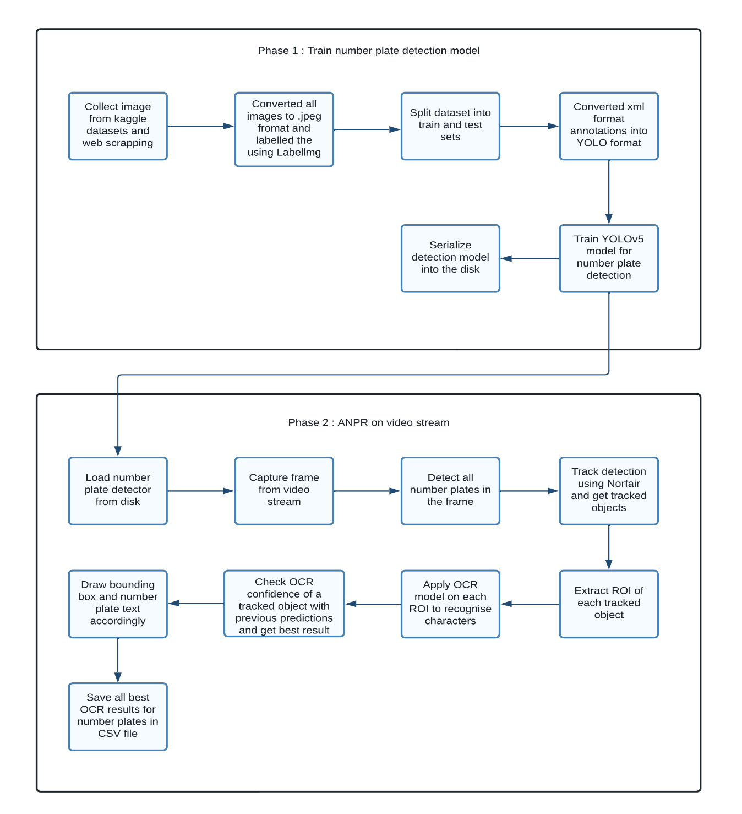

# ANPR System

## Overview

Automatic number-plate recognition (ANPR) is a technology that uses optical character recognition on images to read vehicle registration plates to create vehicle location data. It may be used in a variety of public settings to serve a variety of functions, including automatic toll tax collection, car park systems, and automatic vehicle parking systems.

In this work I present a number plate detection system based on object detection using YOLOv5 and recognition using PaddleOCR.

## Dataset
The dataset consists of 928 images different types of vehicles.
These images are collected from:
 
- <a href="https://www.kaggle.com/datasets/andrewmvd/car-plate-detection">Car License Plate Detection Dataset</a>
- <a href="https://www.kaggle.com/datasets/andrewmvd/car-plate-detection">Automatic Number Plate Recognition Dataset</a>
- <a href="https://github.com/Tkvmaster/ANPR-System/blob/main/image_scrapping.ipynb">Web Scraping Images from Google</a>

## Reqirements
- Pytorch
- YOLOv5
- OpenCV
- PaddleOCR
- NorFair

## Proposed System
To solve this data problem, I take a two-step approach. In the first step is number plate detection model is trained using <a href="https://github.com/rkuo2000/yolov5">YOLOv5 model</a>.

The second step is to run the number plate detection model to locate all of the number plate present in an image and extract plate region from that image. Once a number plate is located, preprocessing is performed on ROI image and PaddleOCR is used to recognise characters in the number plate.

When running above proposed ANPR on a video, it causes some issues which makes the ANPR less accurate, such as Jittering, Fluctuation of OCR output. But if the tracker is used, these issues can be rectified. The tracker will be used for getting the best OCR result of a particular detected license plate. 

    
    <em>Work Flow Diagram</em>

 

## Results

Video Source : https://www.videvo.net/video/cars-driving-along-an-indian-freeway/6374/

## Licensing
The code in this project is licensed under [MIT License](LICENSE).